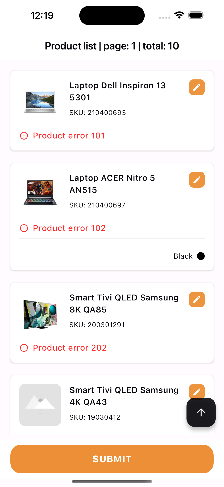
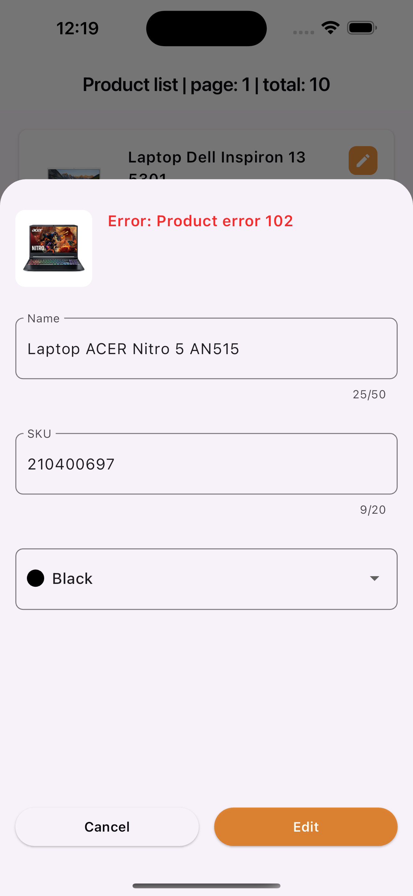
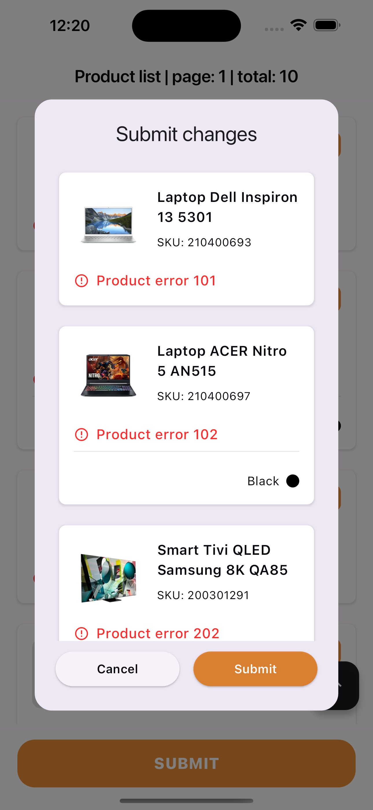

# base_1 (Flutter 3.19.1)

## First Time Setup after clone project
run command in terminal to setup

1. Install and use flutter version 3.19.1
```bash
fvm use 3.19.1
```

2. Generate code command:
```bash
make gen
```

3.Run command to build app
```bash
make run_dev_mobile
```

if you have multiple devices
```bash
fvm flutter run --flavor dev -t lib/main.dart --dart-define=flavor=dev -d <deviceId>
```


## Project Structure
```text
lib
├── app.dart
├── core
│ ├── assets_gen
│ │ └── assets.gen.dart
│ ├── config/ (Constant classes, ex: endpoint, color, etc...)
│ │ ├── app_colors.dart
│ │ ├── app_constatns.dart
│ │ ├── endpoint_constants.dart
│ │ └── env_config.dart
│ ├── extensions/ (Extension for dart classes)
│ │ └── string_extension.dart
│ ├── injection/ (Dependency injection)
│ │ ├── injection.config.dart
│ │ ├── injection.dart
│ │ └── register_module.dart
│ ├── network/ (Network configuration)
│ │ └── interceptor.dart
│ └── util/ (Utility classes)
│     ├── util.dart
│     └── validator_utils.dart
├── features/ (Feature modules)
│ └── list_product
│     ├── data
│     │ ├── data_source/ (Data source for list product screen)
│     │ │ └── remote/ (Remote data source, ex: api, firebase, etc...)
│     │ │     └── api
│     │ │         ├── product_api.dart
│     │ │         └── product_api.g.dart
│     │ │ └── local/ (Local data source, ex: database, shared preference)
│     │ ├── models/ (Entities)
│     │ │ ├── product
│     │ │ │ ├── product_model.dart
│     │ │ │ ├── product_model.freezed.dart
│     │ │ │ └── product_model.g.dart
│     │ │ └── product_color
│     │ │     ├── product_color_model.dart
│     │ │     ├── product_color_model.freezed.dart
│     │ │     └── product_color_model.g.dart
│     │ └── repositories
│     │     └── product_repository_impl.dart
│     ├── domain
│     │ ├── entites
│     │ │ ├── product.dart
│     │ │ ├── product.g.dart
│     │ │ └── product_color.dart
│     │ └── repositories
│     │     └── product_repository.dart
│     └── presentation
│         ├── bloc/ (BLoC for list product screen)
│         │ ├── list_product_bloc.dart
│         │ ├── list_product_bloc.g.dart
│         │ ├── list_product_event.dart
│         │ └── list_product_state.dart
│         ├── list_product_screen.dart
│         └── widgets/ (Widget for list product screen)
│             ├── edit_product_bottom_sheet.dart
│             ├── image_placeholder.dart
│             ├── product_item.dart
│             └── submit_changes_dialog.dart
└── main.dart
```



